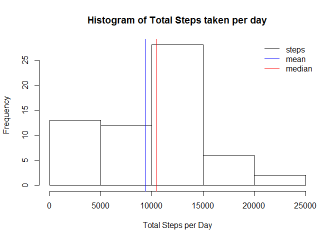
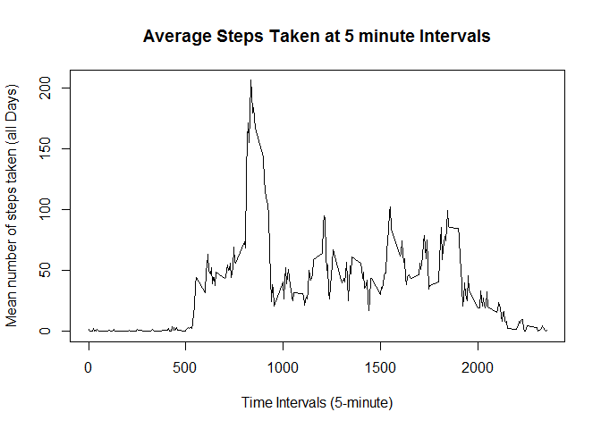
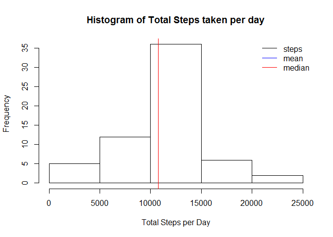
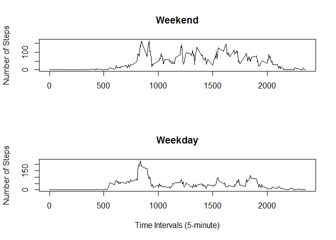

# Reproducible Research: Peer Assessment 1


## Loading and preprocessing the data
* Load the data (i.e. read.csv())

```r
activity <- read.csv("activity.csv", stringsAsFactors = FALSE)
```

* Process/transform the data (if necessary) into a format suitable for your analysis

```r
library("dplyr", warn.conflicts = FALSE, quietly = TRUE)
tblA <- tbl_df(activity)
tblA$date <- as.Date(tblA$date,"%Y-%m-%d")
```


## What is mean total number of steps taken per day?

* Make a histogram of the total number of steps taken each day:

```r
grDate <- group_by(tblA, date)
totalStepsByDay <- summarise(grDate, sum(steps, na.rm = TRUE))
hist(totalStepsByDay$sum,
     xlab="Total Steps per Day", 
     ylab="Frequency", 
     main="Histogram of Total Steps taken per day")

meanStepsByDay <- mean(totalStepsByDay$sum, na.rm = TRUE)
abline(v=meanStepsByDay, col="blue")

medianStepsByDay <- median(totalStepsByDay$sum, na.rm = TRUE)
abline(v=medianStepsByDay, col="red")

legend("topright",
           col = c("black", "blue","red"), 
           legend = c("steps", "mean","median"),
           lty=c(1, 1, 1), bty="n")
```

 

* Calculate and report the mean and median total number of steps taken per day:

* Mean of total steps:

```r
meanStepsByDay
```

```
## [1] 9354.23
```

* Median of total steps:

```r
medianStepsByDay
```

```
## [1] 10395
```

## What is the average daily activity pattern?
* Make a time series plot (i.e. type = "l") of the 5-minute interval (x-axis)
and the average number of steps taken, averaged across all days (y-axis)

```r
grInterval <- group_by(tblA, interval)
stepsByInterval <- summarise(grInterval, mean(steps, na.rm = TRUE))

plot(stepsByInterval$interval, stepsByInterval$mean, 
     lty="solid", 
     xlab="Time Intervals (5-minute)", 
     ylab="Mean number of steps taken (all Days)", 
     main="Average Steps Taken at 5 minute Intervals",
     type="l")
lines(stepsByInterval$interval, stepsByInterval$mean)    
```

 

* Which 5-minute interval, on average across all the days in the dataset, contains the maximum number of steps?

```r
which.max(stepsByInterval$mean)
```

```
## [1] 104
```

## Imputing missing values
Note that there are a number of days/intervals where there are missing values (coded as NA). 
The presence of missing days may introduce bias into some calculations or summaries of the data.

Calculate and report the total number of missing values in the dataset (i.e. the total number of rows with NAs)

```r
sum(is.na(tblA$steps))
```

```
## [1] 2304
```

* Devise a strategy for filling in all of the missing values in the dataset. 
The strategy does not need to be sophisticated. 
For example, you could use the mean/median for that day, or the mean for that 5-minute interval, etc.

I decided to use mean for that 5-minute interval.

* Create a new dataset that is equal to the original dataset but with the missing data filled in:


```r
tblB <- tblA
dim(tblB)[1]
```

```
## [1] 17568
```

```r
for(i in 1:dim(tblB)[1]){
    
    if(is.na(tblB$steps[i])){
        indx <- which(tblB$interval[i] == stepsByInterval$interval)
        tblB$steps[i] <- stepsByInterval$mean[indx]
    }
}
```

* Make a histogram of the total number of steps taken each day and Calculate and report the mean and median total number of steps taken per day. 
Do these values differ from the estimates from the first part of the assignment? 
What is the impact of imputing missing data on the estimates of the total daily number of steps?


```r
grDate <- group_by(tblB, date)
totalStepsByDay <- summarise(grDate, sum(steps, na.rm = TRUE))
hist(totalStepsByDay$sum,
     xlab="Total Steps per Day", 
     ylab="Frequency", 
     main="Histogram of Total Steps taken per day")

meanStepsByDay <- mean(totalStepsByDay$sum, na.rm = TRUE)
abline(v=meanStepsByDay, col="blue")

medianStepsByDay <- median(totalStepsByDay$sum, na.rm = TRUE)
abline(v=medianStepsByDay, col="red")

legend("topright",
           col = c("black", "blue","red"), 
           legend = c("steps", "mean","median"),
           lty=c(1, 1, 1), bty="n")
```

 

* Mean of total steps:

```r
meanStepsByDay
```

```
## [1] 10766.19
```

* Median of total steps:

```r
medianStepsByDay
```

```
## [1] 10766.19
```

As we can see, mean is equal to median and has higher value.

## Are there differences in activity patterns between weekdays and weekends?

* Create a new factor variable in the dataset with two levels -- "weekday" and "weekend" 
indicating whether a given date is a weekday or weekend day.

```r
#set locale to get the right day names
Sys.setlocale("LC_ALL", "English")
```

```
## [1] "LC_COLLATE=English_United States.1252;LC_CTYPE=English_United States.1252;LC_MONETARY=English_United States.1252;LC_NUMERIC=C;LC_TIME=English_United States.1252"
```

```r
tblB$date <- as.Date(tblB$date,"%Y-%m-%d")
days <- weekdays(tblB$date)

tblB$dayType <- ifelse(days == "Saturday" | days == "Sunday", "Weekend", "Weekday")
```

* Make a panel plot containing a time series plot (i.e. type = "l") of the 5-minute interval (x-axis) and the average number of steps taken, averaged across all weekday days or weekend days (y-axis).


```r
par(mfrow = c(2, 1))

grInterval <- group_by(tblB, dayType, interval)
stepsByInterval <- summarise(grInterval, mean(steps, na.rm = TRUE))

weekendSet<-stepsByInterval[stepsByInterval$dayType == "Weekend",]
daySet<-stepsByInterval[stepsByInterval$dayType == "Weekday",]

plot(weekendSet$interval, weekendSet$mean, 
     lty="solid", 
     xlab="", 
     ylab="Number of Steps", 
     main="Weekend",
     type="l")
lines(weekendSet$interval, weekendSet$mean)    

plot(daySet$interval, daySet$mean, 
     lty="solid", 
     xlab="Time Intervals (5-minute)", 
     ylab="Number of Steps", 
     main="Weekday",
     type="l")
lines(daySet$interval, daySet$mean)    
```

 

